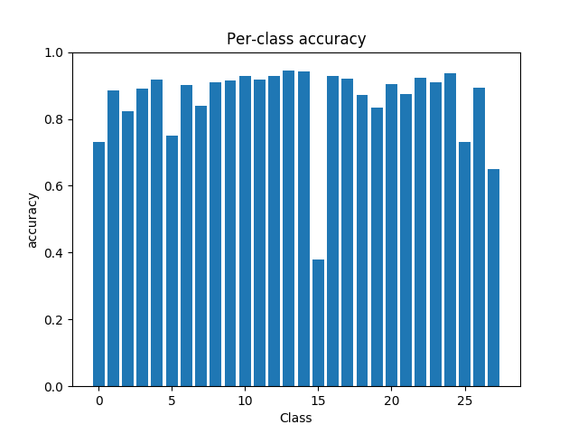
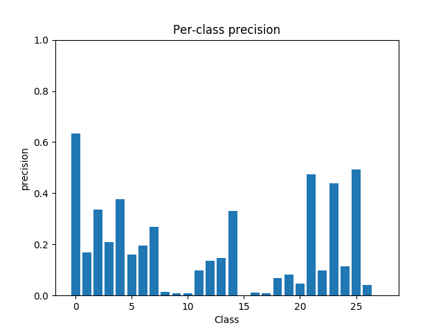
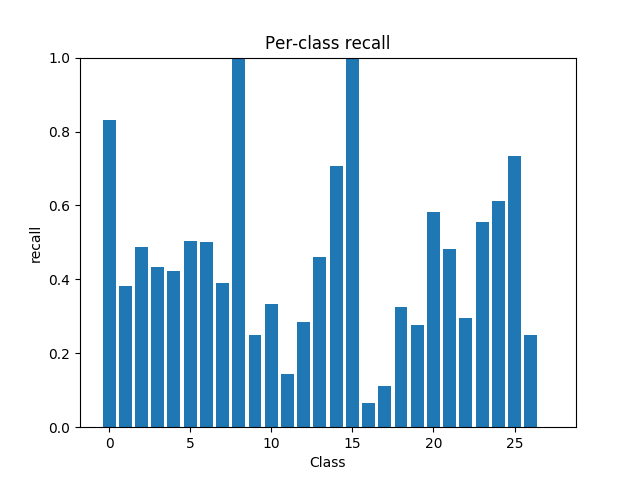
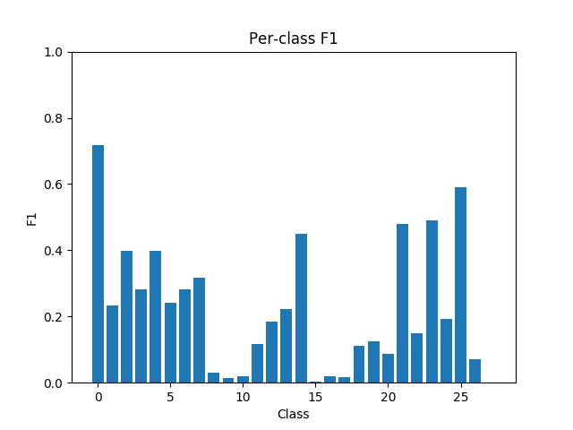
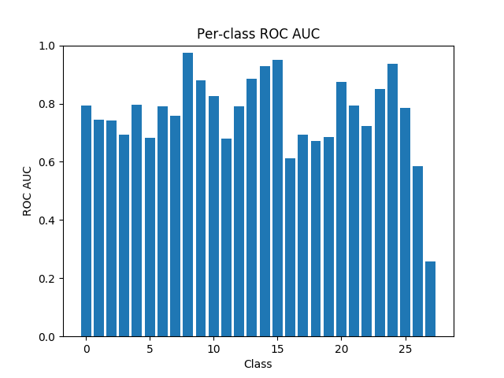
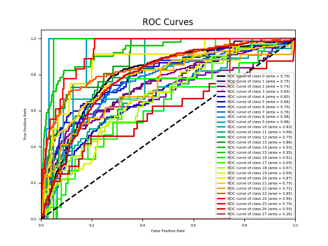
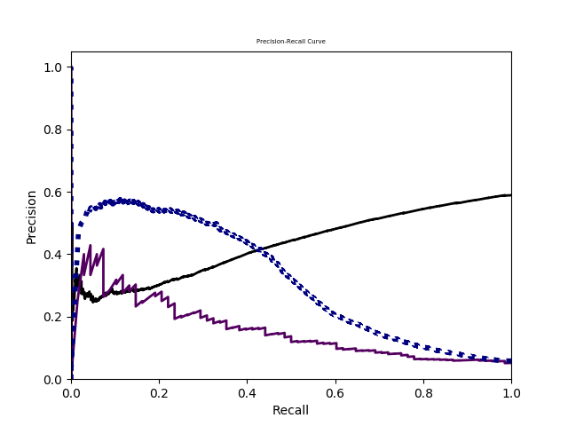
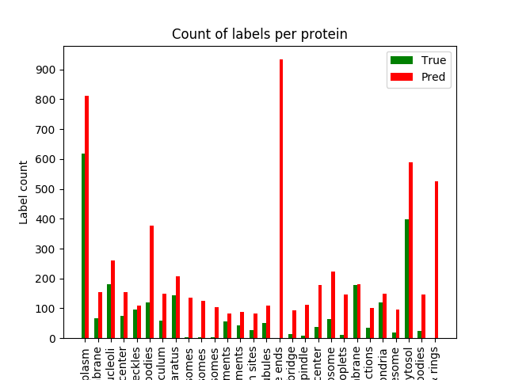

| Metric | Value | Description |
|---|---|---|
| macro-F1 | 0.2228571290063093 | F-measure averaging on each label |
| instance-F1 | 0.322011544011544 | F-measure averaging on each instance |
| micro-F1 | 0.3215412347904462 | F-measure averaging on the prediction matrix |
| weighted-F1 | 0.45953792647916947 | F-measure with weighting |
| Hamming loss | 0.1433809523809524 | The fraction of misclassified labels |
| ranking loss | 0.19796025403608739 | The average fraction of reversely ordered label pairs of each instance |
| one-error | 0.992 | The fraction of instances whose most confident label is irrelevant |
| coverage | 17.816 | The number of more labels on average should include to cover all relevant labels |
| average precision | 0.12007863953884614 | The average fraction of relevant labels ranked higher than one other relevant label |
| macro-AUC | 0.7636123564588091 | AUC averaging on each label. S_macro is the set of correctly ordered instance pairs on each label |
| instance-AUC | 0.8035386158594492 | AUC averaging on each instance. S_instance is the set of correctly ordered label pairs on each instance |
| micro-AUC | 0.7866594568570918 | AUC averaging on prediction matrix. Smicro is the set of correct quadruples. |
------
 
 
 
 
 
 
 
 