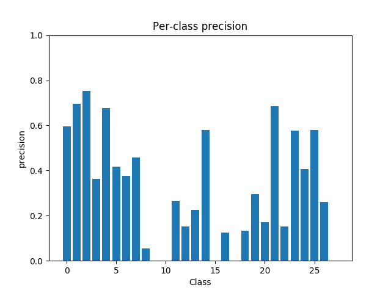
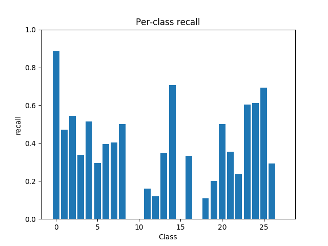
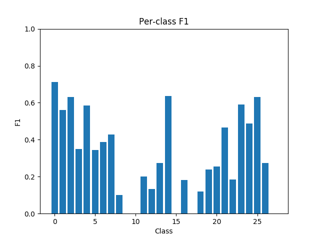
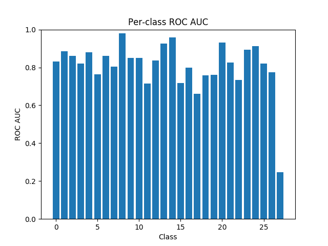
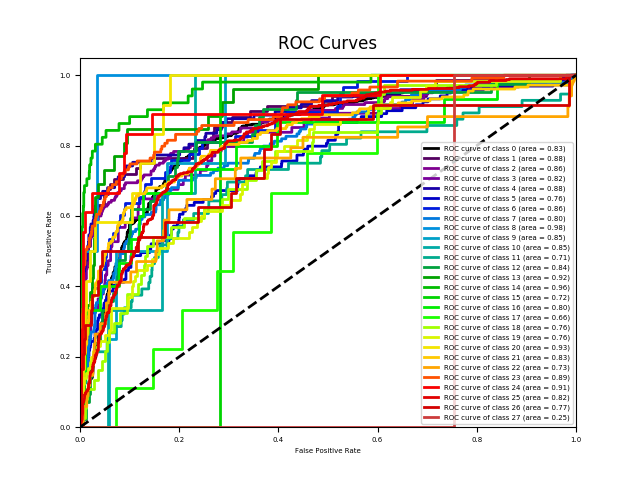
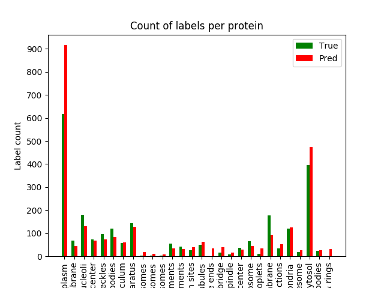

| Metric | Value | Description |
|---|---|---|
| macro-F1 | 0.31334853956417286 | F-measure averaging on each label |
| instance-F1 | 0.5164634920634922 | F-measure averaging on each instance |
| micro-F1 | 0.5357211631041787 | F-measure averaging on the prediction matrix |
| weighted-F1 | 0.5332954999320948 | F-measure calculated for each label, and averaged as weighted by the number of true instances for each label |
| Hamming loss | 0.0574047619047619 | The fraction of misclassified labels |
| ranking loss | 0.15170075735992403 | The average fraction of reversely ordered label pairs of each instance |
| one-error | 0.8013333333333333 | The fraction of instances whose most confident label is irrelevant |
| coverage | 16.998666666666665 | The number of more labels on average should include to cover all relevant labels |
| average precision | 0.17958910685485444 | The average fraction of relevant labels ranked higher than one other relevant label |
| macro-AUC | 0.8094116849839867 | AUC averaging on each label. S_macro is the set of correctly ordered instance pairs on each label |
| instance-AUC | 0.8496185493827161 | AUC averaging on each instance. S_instance is the set of correctly ordered label pairs on each instance |
| micro-AUC | 0.8445054433040983 | AUC averaging on prediction matrix. Smicro is the set of correct quadruples. |
------
 
 
 
 
 
 
 
 