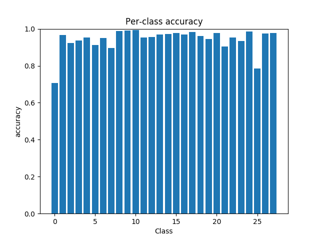
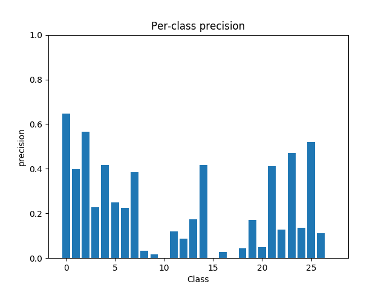
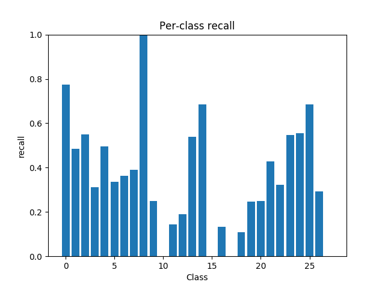
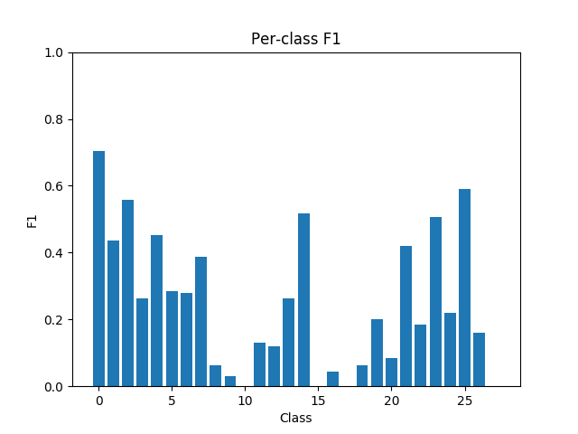
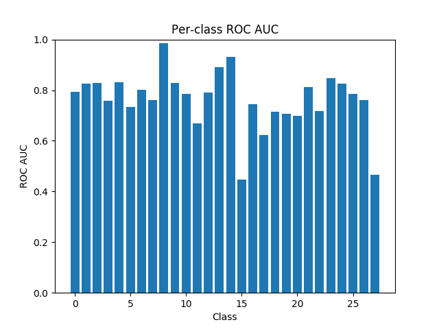
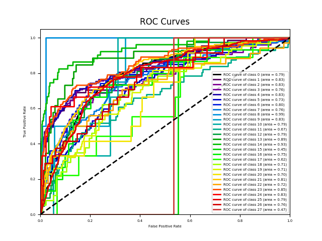
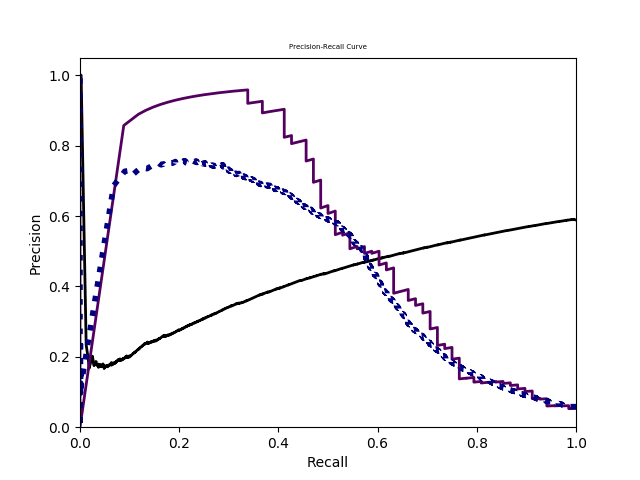
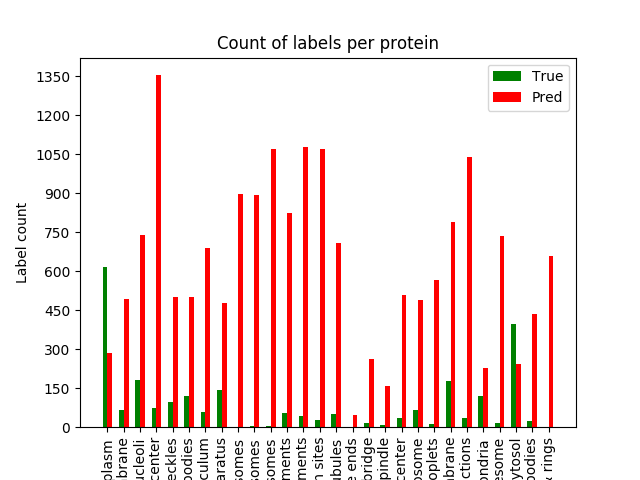

| Metric | Value | Description |
|---|---|---|
| macro-F1 | 0.14496976730479313 | F-measure averaging on each label |
| instance-F1 | 0.1535370809046674 | F-measure averaging on each instance |
| micro-F1 | 0.14407367066046145 | F-measure averaging on the prediction matrix |
| weighted-F1 | 0.3221838790101069 | F-measure calculated for each label, and averaged as weighted by the number of true instances for each label |
| Hamming loss | 0.4116190476190476 | The fraction of misclassified labels |
| ranking loss | 0.551450403608737 | The average fraction of reversely ordered label pairs of each instance |
| one-error | 1.0 | The fraction of instances whose most confident label is irrelevant |
| coverage | 20.66 | The number of more labels on average should include to cover all relevant labels |
| average precision | 0.09109386441072684 | The average fraction of relevant labels ranked higher than one other relevant label |
| macro-AUC | 0.6913743020724148 | AUC averaging on each label. S_macro is the set of correctly ordered instance pairs on each label |
| instance-AUC | 0.6145474988129155 | AUC averaging on each instance. S_instance is the set of correctly ordered label pairs on each instance |
| micro-AUC | 0.598531722403886 | AUC averaging on prediction matrix. Smicro is the set of correct quadruples. |
------
 
 
 
 
 
 
 
 