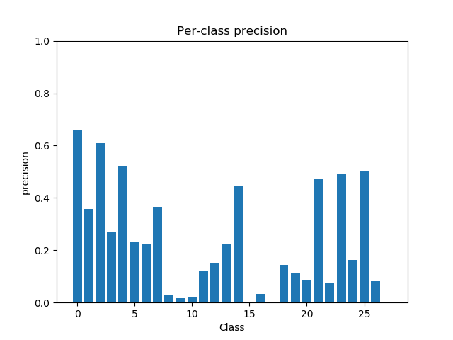
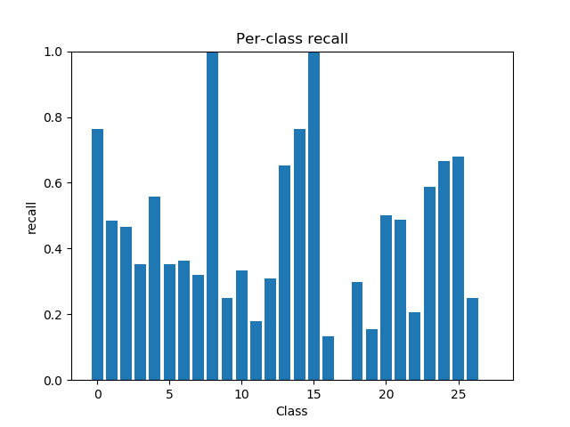
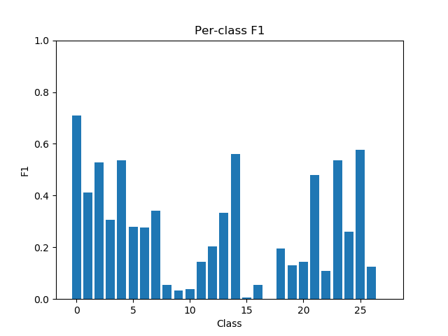
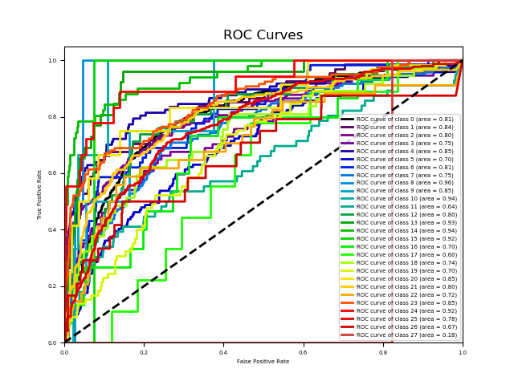
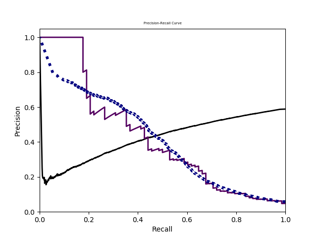

| Metric | Value | Description |
|---|---|---|
| macro-F1 | 0.2631957488768124 | F-measure averaging on each label |
| instance-F1 | 0.4160301402301402 | F-measure averaging on each instance |
| micro-F1 | 0.42055781886555943 | F-measure averaging on the prediction matrix |
| weighted-F1 | 0.48762009065543466 | F-measure calculated for each label, and averaged as weighted by the number of true instances for each label |
| Hamming loss | 0.08804761904761904 | The fraction of misclassified labels |
| ranking loss | 0.19308886277302942 | The average fraction of reversely ordered label pairs of each instance |
| one-error | 0.914 | The fraction of instances whose most confident label is irrelevant |
| coverage | 17.926 | The number of more labels on average should include to cover all relevant labels |
| average precision | 0.1454113602171369 | The average fraction of relevant labels ranked higher than one other relevant label |
| macro-AUC | 0.7796408519080323 | AUC averaging on each label. S_macro is the set of correctly ordered instance pairs on each label |
| instance-AUC | 0.8163066737891738 | AUC averaging on each instance. S_instance is the set of correctly ordered label pairs on each instance |
| micro-AUC | 0.8055894005400487 | AUC averaging on prediction matrix. Smicro is the set of correct quadruples. |
------
 
 
 
 
 
 
 
 